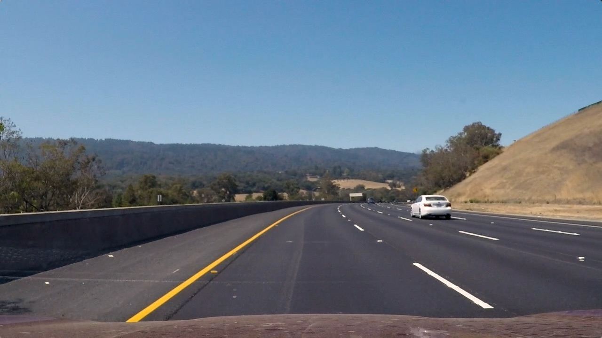

## Project Handbook


### Project Items
---

**Advanced Lane Finding Project**

The goals / steps of this project are the following:

* Compute the camera calibration matrix and distortion coefficients given a set of chessboard images.
* Apply a distortion correction to raw images.
* Use color transforms, gradients, etc., to create a thresholded binary image.
* Apply a perspective transform to rectify binary image ("birds-eye view").
* Detect lane pixels and fit to find the lane boundary.
* Determine the curvature of the lane and vehicle position with respect to center.
* Warp the detected lane boundaries back onto the original image.
* Output visual display of the lane boundaries and numerical estimation of lane curvature and vehicle position.

[//]: # (Image References)

[image1]: ./output_images/undistort_image_before_to_after.jpg "Undistorted"
[image2]: ./test_images/test3.jpg "Road Untransformed"
[image3]: ./output_images/calibrating_images/test3_calibration_after.jpg "Road Transformed"
[image4]: ./output_images/binrized_images/test3_binarization_after.jpg "Binary Example"  
[image5]: ./output_images/transformed_images/test3_transformation_after.jpg "Transformation Example"
[image6]: ./output_images/lane_fitting/test3_lane_fitting_after.jpg "Fit Visual"
[image7]: ./output_images/final_image/test3_blend_image.jpg "Output"
[video1]: ./project_10_output.mp4 "Video"

### [Rubric](https://review.udacity.com/#!/rubrics/571/view) Points

#### Here I will consider the rubric points individually and describe how I addressed each point in my implementation.  

---

#### Writeup / README

#### 1. Provide a Writeup / README that includes all the rubric points and how you addressed each one.  You can submit your writeup as markdown or pdf.  [Here](https://github.com/udacity/CarND-Advanced-Lane-Lines/blob/master/writeup_template.md) is a template writeup for this project you can use as a guide and a starting point.  

You're reading it!

---

### Camera Calibration 

#### 1. Briefly state how you computed the camera matrix and distortion coefficients. Provide an example of a distortion corrected calibration image.

The code for this step is contained in the file of "`Camera_Calibration`", which locates **`Camera_Calibration/camera_calibration.py`**. I run this code with py2, and you will see the result files of **`Camera_Calibration/cam_param_py2.pickle`** and **`output_images/undistort_image_before_to_after.jpg`**.  

This code has two main functions, which are `calibrate_camera()` and `undistort_image()`
- In the function of calibrate_camera(), I introduced the overload modifier for overlap calibration, that is `@determine_calibration`, and more details description at the line of 12-15 in the file of camera_calibration.py.
- In the calibrate_camera(), i start by preparing "world points", named `wdp`, which will be the (x, y, z) coordinates of the chessboard corners in the world. Because worldpoints are homography matrix, the value of z is 0. The same way, `corners` is 2d points in pixel plane.
- Then i got `worldpoints` and `pixelpoints` by the function of `cv2.findChessboardCorners()` and to compute the camera calibration and distortion coefficients using the `cv2.calibrateCamera()` function.  
- I applied this distortion correction to the test image using the `cv2.undistort()` function and obtained this result: 

![alt text][image1]


### Pipeline (single images)

#### 1. Provide an example of a distortion-corrected image.

To demonstrate this step, I will describe how I apply the distortion correction to one of the test images like the following image, and the origin image in the path of "./test_images/*.jpg", you will see the difference.

<table style="width:100%">
  <tr>
    <th>
      <p align="center">
           
           <br>test3_raw
      </p>
    </th>
    <th>
      <p align="center">
           
           <br>test3_undistort
      </p>
    </th>
  </tr>
</table>

#### 2. Describe how (and identify where in your code) you used color transforms, gradients or other methods to create a thresholded binary image.  Provide an example of a binary image result.

I used a combination of color and gradient thresholds to generate a binary image (thresholding steps at lines 67 through 94 in `./Image_Binarization/image_binarization.py`).  Here's an example of my output for this step.

- In order to detect the yellow lines, I defined the function of `thresh_frame_hsv()`, which used `cv2.cvtColor(frame, cv2.COLOR_BGR2HSV)`. also I set the threshold of V to highlight yellow lines. 
- For the white lines, i employed `get_binary_from_equalized_grayscale()`, which used `cv2.equalizeHist(gray_image)`. It can clearly understand the overall gray distribution of the image, which is helpful for the extraction of lane lines behind.
- Furthermore, i also used Sobel Algorithm, `cv2.Sobel()`, to estimating the lines gradients. 
- At the end of the algorithmic function of morphologyEx was used, and it can filled the black areas in binary image well.

Here are the raw [left] and output[right] images:


![alt text][image4]

#### 3. Describe how (and identify where in your code) you performed a perspective transform and provide an example of a transformed image.

The code for my perspective transform includes a function called `transforming_image()`, which appears in lines 13 through 52 in the file `perspective_transform.py` (Perspective_Transform/perspective_transform.py).
- I used the function of cv2.warpPerspective(), which takes as inputs an image (`img`), as well as source (`src`) and destination (`dst`) points. I save the results image in the path of `./output_images/transformed_images`.
- In order to perform the perspective warping, i set 4 points in the original space and 4 points in the warped space. For this purpose, i used software with mtpaint(`sudo apt-get install mtpaint`) to get point as follows:

**First Params**
```python
    h, w = img.shape[:2]

    src = np.float32([[w, h-15],    # br
                      [0, h-15],    # bl
                      [540, 460],   # tl
                      [735, 460]])  # tr
    dst = np.float32([[w, h],       # br
                      [0, h],       # bl
                      [0, 0],       # tl
                      [w, 0]])      # tr

```

This resulted in the following source and destination points:

| Source        | Destination   | 
|:-------------:|:-------------:| 
| 1280, 705     | 1280, 720     | 
|    0, 705     |    0, 720     |
|  540, 460     |    0,   0     |
|  735, 460     | 1280,   0     |

**After reviewed** (it is so hard)
```python
    src = np.float32([[1080,710],     # br
                      [200,710],        # bl
                      [590,452],      # tl
                      [729,452]])     # tr
    dst = np.float32([[980, 720],       # br
                      [300, 720],       # bl
                      [300, 0],       # tl
                      [980, 0]])      # tr
```

I verified that my perspective transform was working as expected by drawing the `src` and `dst` points onto a test image and its warped counterpart to verify that the lines appear parallel in the warped image.

![alt text][image5]

#### 4. Describe how (and identify where in your code) you identified lane-line pixels and fit their positions with a polynomial?

The code for my lane fitting includes a function called `get_fits_by_sliding_windows()`, which appears in lines 113 in the file `lane_fit.py` (Lane_Fit/lane_fit.py).

- In order to fitting the lane lines, i build two functions of `get_fits_by_sliding_windows()` and `get_fits_by_previous_fits()`, the former is for single picture, and the latter is for video stream processing. 
- For a single image, If we get new image, and we never know where the lane-lines are, we must treat the lane pixel form bottom to top on the frame. so we take a histogram, `histogram = np.sum(binary_img[height//2:-30, :], axis=0)`, of the bottom half of the image, after i make two windows for sliding towards the top side of image, the we can precisely the location of lane line.
- For video streams, the image frame is continuous, and lane line will not have a big edge jump, so it is very important to know the lane line position of the previous frame. this method is implemented in `get_fits_by_previous_fits()`. This function has further application the latter video stream.
- In order to make the code modular, I put the extraction and drawing of lane lines on the class of `class Line`, includes `update_line()` and `draw()`, you can see it on line 17 through 102. 
![alt text][image6]

#### 5. Describe how (and identify where in your code) you calculated the radius of curvature of the lane and the position of the vehicle with respect to center.

I did this in lines 85 through 102 in my code in `Lane_Fit/lane_fit.py`

- Firstly, for offset the center of lane, i employed the function of `compute_offset_from_center()` which locate in `main_process.py`. In this way, we can estimate the approximate position of the bottom of the lane line. The function code is list in here.
```python
    line_lt_bottom = np.mean(line_lt.all_x[line_lt.all_y > 0.95 * line_lt.all_y.max()])
    line_rt_bottom = np.mean(line_rt.all_x[line_rt.all_y > 0.95 * line_rt.all_y.max()])
    lane_width = line_rt_bottom - line_lt_bottom
    midpoint = frame_width / 2
    offset_pix = abs((line_lt_bottom + lane_width / 2) - midpoint)
    offset_meter = xm_per_pix * offset_pix
```
- For the previous lane-line detection, i use `np.polyfit()` to fitting left and right lane and and returns line_lt, line_rt, and img_fit, we can calculate the radius of curvature by the returned parameters.
- Then we call the `Line.curvature()` and `Line.curvature_meter()` to get radius.
```python
    @property
    # average of polynomial coefficients of the last N iterations
    def average_fit(self):
        return np.mean(self.recent_fits_pixel, axis=0)

    @property
    # radius of curvature of the line (averaged)
    def curvature(self):
        y_eval = 0
        coeffs = self.average_fit
        return ((1 + (2 * coeffs[0] * y_eval + coeffs[1]) ** 2) ** 1.5) / np.absolute(2 * coeffs[0])

    @property
    # radius of curvature of the line (averaged)
    def curvature_meter(self):
        y_eval = 0
        coeffs = np.mean(self.recent_fits_meter, axis=0)
        return ((1 + (2 * coeffs[0] * y_eval + coeffs[1]) ** 2) ** 1.5) / np.absolute(2 * coeffs[0])
```

#### 6. Provide an example image of your result plotted back down onto the road such that the lane area is identified clearly.

I implemented this step in lines 99 through 135 in my code in `main_process.py` in the function `main_process()`. The whole code includes camera calirabtion, image undistorted, image binarization, image transformation, image lane fitting and blend the results into final image. Here is an example of my result on a test image:

![alt text][image7]

---

### Pipeline (video)

#### 1. Provide a link to your final video output.  Your pipeline should perform reasonably well on the entire project video (wobbly lines are ok but no catastrophic failures that would cause the car to drive off the road!).

Here's a [project_10_output.mp4](./project_10_output.mp4)
Here's a [project_10_output_after_reviewed.mp4](./project_10_output_after_reviewed.mp4)
If you can not open the linkage, you can find it in current path and with its name of project_10_output_after_reviewed.mp4.

---

### Discussion

#### 1. Briefly discuss any problems / issues you faced in your implementation of this project.  Where will your pipeline likely fail?  What could you do to make it more robust?

In the process of two-sided lane line fitting, there are often errors in the process of fitting lanes, then i reviewed the video courses and refered relavent data, the final display results were completion; After testing challenge video, the lane line fitting function is very poor, even lost. For the improved method, we can use the method of deep learning to improve the effect.
